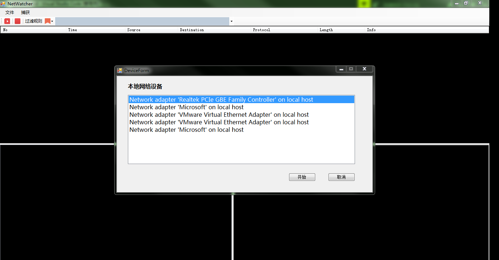
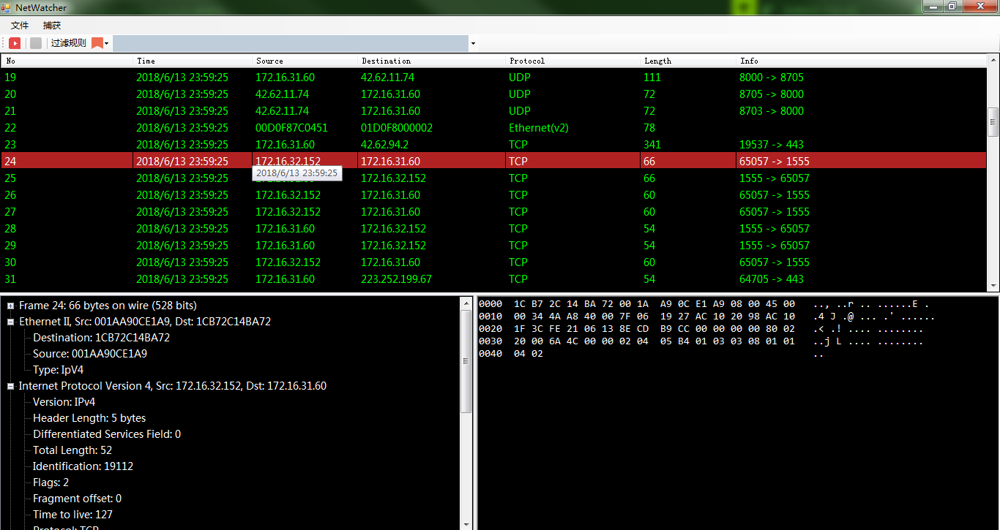
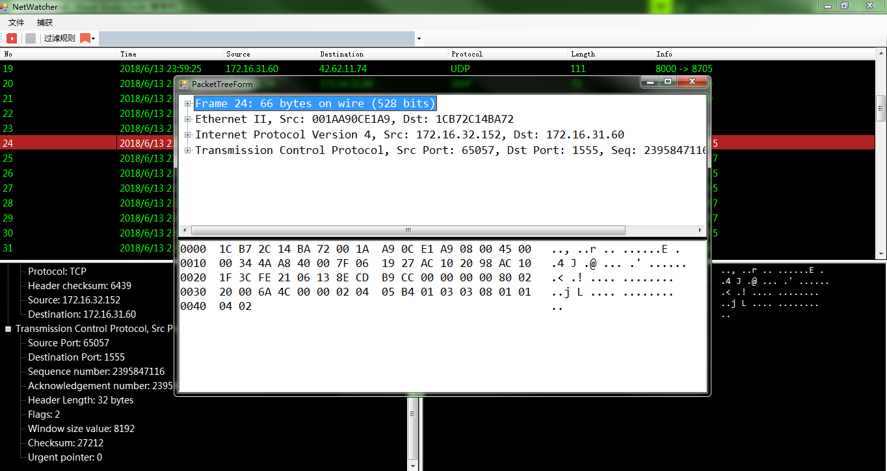
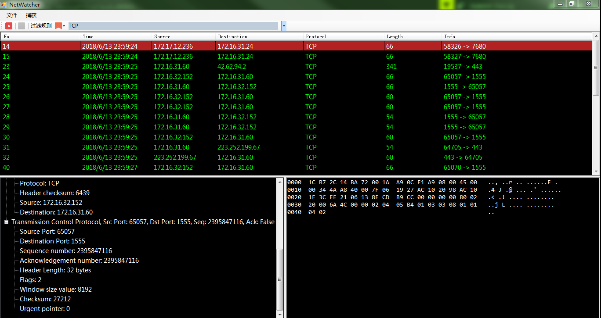
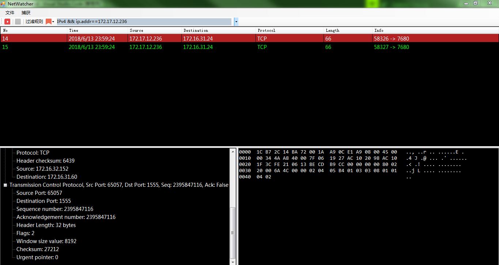

## NetWatcher - A Net Sniffer base on C#

基于C#实现的类似WireShark的网络嗅探器，可以在指定的本地网卡抓包并进行数据帧的拆分分析，支持根据协议和端口以及IP地址进行数据包的过滤，支持抓取数据的保存和读取。

## 第三方插件

**SharpPcap.dll**

**PacketDotNet.dll**

## 基本功能

**选择本地网络适配器进行监听：**

**运行并捕获数据包，将捕获到所有数据包的概要信息显示在上面，数据包的详细信息显示在下面两个窗口：**

**双击数据包可以进一步查看详细信息：**

**这里通过TCP端口筛选数据包：**

**这里通过IP地址筛选数据包：**

